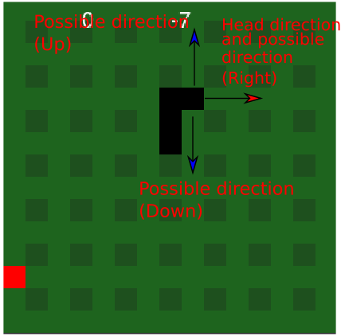
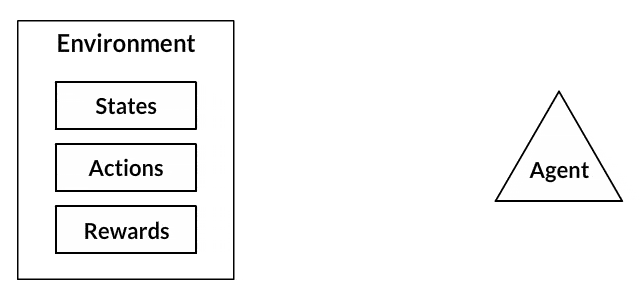
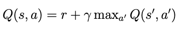
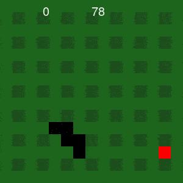

# SnakeGame (PyGame) with Keras and Q-learning method

This repository presents ONE way to design a snake game with classes theory and played with a DNN using Q-learning. The objective is designed a intelligence model that it can play and learn being self-sufficient. 

The required libraries are:
* Pygame (2.0.1)
* Numpy (Last version)
* random
* deque
* TensorFlow (2.1.0)
* Keras (This library need that tensorflow is installed)

Firstly, it is made the snake code and all its clasees to can play. For this purpose
I have used the PyGame library but if you feel more comfortable with other as turtle library
it does not matter, the important is the concept. Once the game has been created and running the 
next step is to include the AI, in this case a DNN with three layers with 30 neurons per layer. 

To made the game I have used four classes: snake, canvas, DNN and apple. How I said before is possible to program this game and this project from different ways. Being possible to use more classes than me or using a monolithic method. 

One way to easy the understood of the project is through the thought that the canvas is is like a real table, and the DNN is a boy with a radio control that he uses to control a robot snake. Also there is a magic apple that can change its position when it is touched for the robot snake. The robot snake is controlled for the child (DNN) but in the first iterations the boy does not know to use the radio control, and the robot snake crashes with the table or with itself. With this example I try to explain the sense of work
with classes, where each class has its function. The DNN (Deep neuron network) learning through the state of the robot and with its fails and rewards. The robot snake is the snake class with its movements and finally the last class is the apple that is magic, and it can appear randomly in the table· I hope that this light and funny explanation  may be helpful to you to have a general vision of the project. 

## Canvas class:

The canvas is the base of the game because all directions, distances and positions are processed in this class. For this reason, this class is larger than the other classes in the game. In addition, this class is where we define the DQN and train the network too. 

## Apple class:

To avoid problems is more useful divided every part of the code in classes, that is the sense of this
class. The apple class allows to create objects emulating a apple in the game. Its aim is simple, to appear
in the canvas in a random position and draw the apple, no more. This class has only two method that describe
the below behaviour "def pos_apple" and def "draw_apple". This object has the position X and Y as main variables

## Snake class:

The snake class is more complex than apple class because the snake in the game has number of actions than apple.
The main methods are:
* The snake Movement: is based in two parameters, the first one is the direction of the head, there are 4 directions:
up, down right and left. If the head snake has direction up its movement only can be up, right or left. In this case the
  snake can not move to down.
  

* The snake collide: these methods are used to define when the snake hits with the canvas edges and 
with itself. Two method are defined for this. "def collide_self_wall" to define the type of hit and
  "def collide" to analise if the hit was done. 
  
* The next movement is the eat apple: to know if the snake eats an apple it is necessary to know if the snake hit
the apple. Again, I have used the "def collide" method but in this case with the apple position. 
  
*Draw snake: to draw correctly the snake with their different body parts. 

*Reset: used to draw the snake in the center of the canvas and reset the score values. 

# DQN (Deep Q Network) class

This is the core of the project, this network will can learn and play with easly. The Deep-Q learning
is bases in DNN (deep neural network), the main difference is that included the concept of reward , 
this value is extremely important to punishing or rewarding the network. The next gif explains easily the visual way 
the reinforcement learning. The environment sends a state (where this is the snake and its environment) and a reward(if
the snake is doing a good movement the reward is positive but if it is a bad movement the reward is a punishment). With
the state and the reward the network adjusts its weights to reduce the error. 

There are a lot of web pages where explain mathematical this method. The clue in all of this is the Bellman equation.
This equation that define the Q-value of the action (a), and the state (s) . This value is extracted for the sum of the reward obtained for 
's' and 'a' and, 

The explanation for this equation is as follows. The Q-value of state s and action a (Q(s, a))must be equal to the 
reward r obtained by executing that action, plus the Q-value of executing the best possible action a' from the next 
state s', multiplied by a discount factor γ, which is a value with range γ ∈ (0, 1]. This value
γ is used to decide how much weight we want to give to short and long term rewards, and it is a hyperparameter that
we must decide ourselves.

The params of the network are approximated is important to understand that in Deep-Learning these values are not exact. 
For this reason, the best way to create the best model is testing with different params. Some params will do that the 
training to be more precise but this always it will do that to be slower. 
In the next link there is a URL to wikipedia for the  [Reinforcement-Learning](https://en.wikipedia.org/wiki/Q-learning)

The DNN is formed for three layer, each layer has 30 neurons, but it is possible to change this value. The input layer has 
12 inputs. These values are: the first four define if the snake is above or below the apple, the next four values are if the 
snake is a position to hit with a wall or with itself. And the last four are the direction of the snake. These values are 
expressed in one hot encoding that is the reason why there are three situation with 4 bits a total of 12 inputs. 
Respect the inputs each user can use what it prefers, but these inputs have to show of some way the path toward the apple.
It is possible, with two inputs if they are sufficiently descriptive, the system would work correctly. The inputs are one hot encoding too,
this is because of the system with neuron works better with this type of inputs. 
In the firs inputs the system is slow and clumsy but when it learns that it has not hit with the wall and go to the apple the
network can play like a human. holhaofdsaa

# Bibliography
[https://link.springer.com/content/pdf/10.1007/BF00992698.pdf](https://link.springer.com/content/pdf/10.1007/BF00992698.pdf)

[https://link.springer.com/chapter/10.1007/978-1-4842-3285-9_5](https://link.springer.com/chapter/10.1007/978-1-4842-3285-9_5)

[https://www.jmlr.org/papers/volume5/evendar03a/evendar03a.pdf](https://www.jmlr.org/papers/volume5/evendar03a/evendar03a.pdf)
